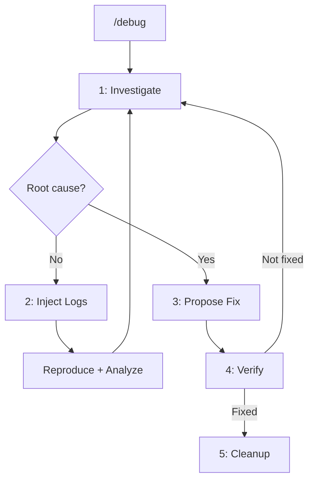

# debug-tools

Claude Code plugin for debugging with code analysis and runtime inspection.

## Overview

Iterative debugging through:
- Code investigation to find root cause
- Confidence scoring for findings
- Targeted log injection with `[DEBUG]` prefix
- Runtime analysis via Console Ninja and Chrome DevTools MCP
- Automatic cleanup of debug logs

## Architecture

```
debug-tools/
├── .claude-plugin/
│   └── plugin.json
├── .mcp.json                  # Console Ninja + Chrome DevTools
├── agents/
│   ├── bug-investigator.md    # Investigates and finds root cause
│   └── log-injector.md        # Adds/removes debug logs
├── commands/
│   └── debug.md               # Main entry point
└── skills/
    └── debugging/
        └── SKILL.md           # Framework-specific patterns
```

## Workflow



### Phases

| Phase | Description | Agent |
|-------|-------------|-------|
| 1. Investigate | Analyze code, find root cause | bug-investigator |
| 2. Inject Logs | Add logs at strategic points | log-injector |
| 3. Propose Fix | Suggest minimal correction | bug-investigator |
| 4. Verify | User confirms fix works | - |
| 5. Cleanup | Remove debug logs automatically | log-injector |

## Command

| Command | Description |
|---------|-------------|
| `/debug-tools:debug "description"` | Start debugging session |

## Agents

| Agent | Role |
|-------|------|
| `bug-investigator` | Investigates code, finds root cause with confidence scoring |
| `log-injector` | Adds targeted debug logs, removes them after fix |

## Confidence Scoring

| Score | Meaning | Action |
|-------|---------|--------|
| >= 70 | High - clear evidence | Report as probable cause |
| 50-69 | Medium - possible | Suggest logs to confirm |
| < 50 | Low - speculation | Do not report |

## When to Use

- Bug with unexpected behavior
- Silent errors or intermittent failures
- Issues requiring runtime data

## When NOT to Use

- Syntax errors (linter resolves)
- Type errors (TypeScript resolves)
- Obvious bugs in diff (use code review)

## MCP Integration

Optional MCP servers for enhanced debugging:

| MCP | Purpose |
|-----|---------|
| Console Ninja | Runtime values, test status, code coverage |
| Chrome DevTools | Network inspection, browser console, DOM |

## Log Format

```javascript
console.log('[DEBUG] [file:line] description', { values });
```

## Cleanup

Debug logs are removed automatically when bug is fixed.

Manual check:

```bash
grep -rn '\[DEBUG\]' . --include='*.ts' --include='*.tsx' --include='*.js' --include='*.jsx'
```
