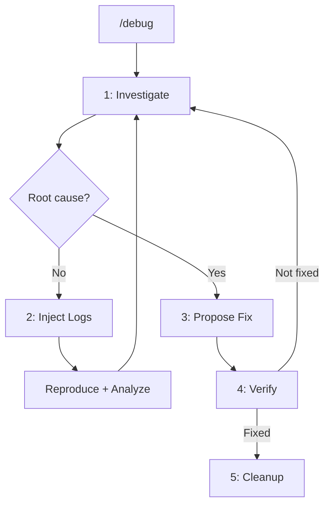

# Debug Tools

Iterative debugging workflow for Claude Code with confidence scoring and runtime analysis.

> **Part of [claude-code-extras](https://github.com/adeonir/claude-code-extras)** - A curated marketplace of Claude Code plugins for feature development, debugging, frontend generation, and git helpers.

## Features

- Code investigation to find root cause
- Confidence scoring for findings (High >= 70, Medium 50-69)
- Strategic log injection with `[DEBUG]` prefix
- Runtime analysis via Console Ninja MCP
- Browser debugging via Chrome DevTools MCP
- Automatic cleanup of debug logs

## Installation

### Prerequisites

- [Claude Code](https://claude.ai/code) - Anthropic's official CLI for Claude

### Add Marketplace

First, add the marketplace to Claude Code (only needed once):

```bash
/plugin marketplace add adeonir/claude-code-extras
```

### Install Plugin

```bash
/plugin install debug-tools
```

This command automatically:
- Downloads the plugin from the marketplace
- Configures Console Ninja and Chrome DevTools MCPs for runtime inspection
- Makes the `/debug-tools:debug` command available

> **Note:** Console Ninja requires the [VS Code extension](https://marketplace.visualstudio.com/items?itemName=WallabyJs.console-ninja) installed. Chrome DevTools requires Chrome running with [remote debugging enabled](https://developer.chrome.com/docs/devtools/remote-debugging/).

## Quick Start

```bash
# Start debugging session
/debug-tools:debug "user cannot login after page refresh"

# The workflow is conversational:
# 1. Agent investigates and reports findings with confidence scores
# 2. If needed, agent injects debug logs
# 3. You reproduce the bug and share console output
# 4. Agent proposes fix
# 5. You verify and agent cleans up logs
```

## Command

| Command | Description |
|---------|-------------|
| `/debug-tools:debug "description"` | Start iterative debugging session |

## Workflow



### Phases

| Phase | Description | Agent |
|-------|-------------|-------|
| 1. Investigate | Analyze code, find root cause | bug-investigator |
| 2. Inject Logs | Add logs at strategic points | log-injector |
| 3. Propose Fix | Suggest minimal correction | bug-investigator |
| 4. Verify | User confirms fix works | - |
| 5. Cleanup | Remove debug logs automatically | log-injector |

## Confidence Scoring

| Score | Meaning | Action |
|-------|---------|--------|
| >= 70 | High - clear evidence | Report as probable cause |
| 50-69 | Medium - possible | Suggest logs to confirm |
| < 50 | Low - speculation | Do not report |

## Log Format

All debug logs use consistent format for easy identification:

```javascript
console.log('[DEBUG] [file:line] description', { values });
```

- `[DEBUG]` - Prefix for grep and cleanup
- `[file:line]` - Location reference
- `{ values }` - Relevant variable state

## When to Use

- Bug with unexpected behavior
- Silent errors or intermittent failures
- Issues requiring runtime data

## When NOT to Use

- Syntax errors (linter resolves)
- Type errors (TypeScript resolves)
- Obvious bugs in diff (use code review)

## MCP Servers

The plugin can leverage these MCP servers if installed:

| MCP | Purpose |
|-----|---------|
| Console Ninja | Runtime values, test status, code coverage |
| Chrome DevTools | Network inspection, browser console, DOM |

## Example Session

```
User: /debug-tools:debug "Form submission fails silently"

Agent: Investigating form submission flow...

**[85] Missing error handling**
- File: src/api/submit.ts:42
- Evidence: catch block is empty
- Fix: Add error state update

## Proposed Fix

**Confidence: 85**

Root cause: Error swallowed in catch block

```diff
// src/api/submit.ts:42
catch (error) {
-  // silently ignored
+  setError(error.message);
}
```

Apply this fix?

User: Yes

Agent: Fixed. Please try submitting the form again.

User: Works now!

Agent: Bug resolved.

## Cleanup Complete

Removed 0 debug logs (none were needed).
```

## License

MIT
