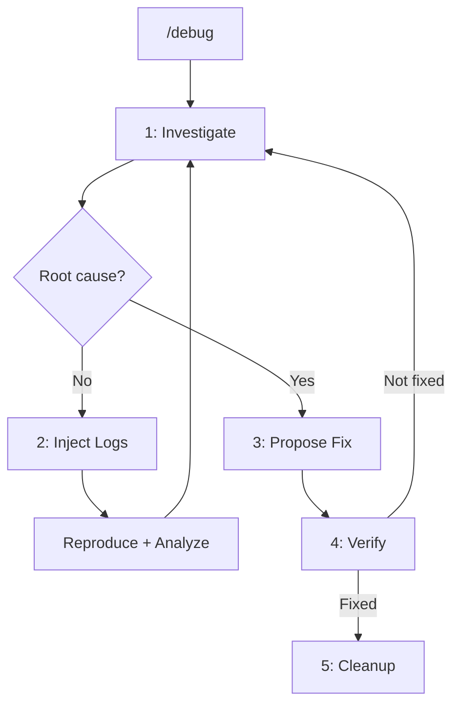

# Debug Command

Start an iterative debugging session to find and fix bugs.

## Arguments

- `"bug description"` - Description of the bug or unexpected behavior

Arguments received: $ARGUMENTS

## Workflow

## Phases

### Phase 1: Investigate

Invoke the `bug-investigator` agent to:
- Analyze code related to the bug
- Find root cause with confidence scoring
- Report findings >= 70 confidence as probable cause
- Suggest logs for findings 50-69 confidence

### Phase 2: Inject Logs (if needed)

If runtime data is needed, invoke the `log-injector` agent to:
- Add targeted `[DEBUG]` logs at strategic points
- Report locations and what each log captures
- Ask user to reproduce the bug

### Phase 3: Propose Fix

When root cause is confirmed:
- Present minimal fix in diff format
- Include confidence score
- Ask user to approve

### Phase 4: Verify

After fix is applied:
- Ask user to verify the bug is fixed
- If not fixed, return to Phase 1
- If fixed, proceed to cleanup

### Phase 5: Cleanup

Automatically remove all debug logs:
- Find all `[DEBUG]` statements
- Remove them from code
- Report cleanup summary

## When to Use

- Bug with unexpected behavior
- Silent errors or intermittent failures
- Issues requiring runtime data

## When NOT to Use

- Syntax errors (linter resolves)
- Type errors (TypeScript resolves)
- Obvious bugs in diff (use `/git-helpers:code-review`)

## Notes

- Cleanup is automatic after fix is verified
- Debug logs use `[DEBUG]` prefix for easy identification
- All findings include file:line references
